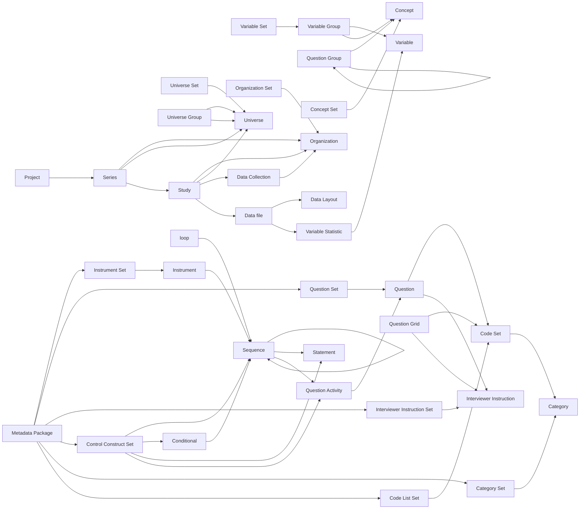

## Overview

This repository provides some utility classes to use the Rest APIs on a Colectica Portal. 
Developed as an in-house resource for CLOSER, we are making it publicly avaliable for others using the Colectica Portal.
If you have any requests or find any bugs, please log it under *Issues*.

If you want further advice or support please contact us at: closer@ucl.ac.uk

Colectica provide examples at https://docs.colectica.com/portal/api/examples/ and the Colectica Documentation for the API is available at https://discovery.closer.ac.uk/swagger/index.html

## Installation

```
pip install colectica-api
```

## Basic usage

```
from colectica_api import ColecticaObject
C = ColecticaObject("colectica.example.com", <username>, <password>)
C.search_item(...)
```

See `example.ipynb` for a more complete example.

## API relationship graph
Colectica Portal supports DDI LIfecycle, the graph below, represents the relationship between the various DDI Elements to enable retrieval of related elements, e.g. variables linked to a specific quesiton


